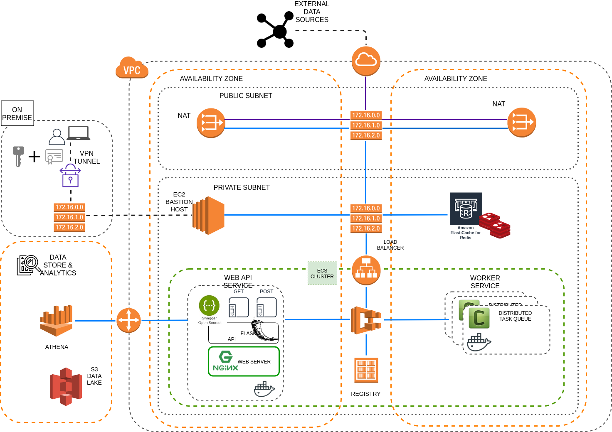

# Docker Flask API

This is a standalone webbased API project, which exposes data on loan payments from
a postgreSQL database to multiple RESTful API endpoints.

The application can be deployed anywhere Docker can be deployed to. Tests are performed
using the lightweight pytest framework. The ORM is set up in SQLAlchemy directly applying
the flask declarative base approach.

It should be fairly easy to replace the logic for loan payments with any other.



### Prerequisites
 
+ Pyenv
+ Pipenv integrated with Pyenv
+ Python Version 3.7.1 installed via Pyenv
+ Docker installed 

#### Installing  

Pyenv and Pipenv is the new way to go for Python version control and virtual environments. Visit
[SecretOfPythonPath](https://github.com/olmax99/secretofpythonpath) 
project for how to get started.

Docker should be installed on the system, else please read the [official Docker docs](https://docs.docker.com/).


## Quickstart

##### 1. Preparing the project environment

1. In the terminal:
+  Verify that there is a file `python.version` present in the `dockerflaskapi/dockerloansapp` directory. Its  
content should be `3.7.1`. This is a file generated by Pyenv. It can be created with `$ pyenv local 3.7.1`. 

In the `dockerflaskapi/loansapp`:

```
$ pipenv install
$ pipenv shell

(app)$ pipenv install Flask
(app)$ pipenv install flask-restplus
(app)$ pipenv install sqlalchemy
(app)$ pipenv install psycopg2
(app)$ pipenv install pytest 

```

2. In PyCharm:

In PyCharm > Settings > Project Interpreter:
+ Verify that the Project Interpreter `Pipenv(loansapp)` is selected.

*NOTE:*   PyCharm should be opened with the loansapp directory as top folder. Otherwise the pipenv interpreter
  might behave not as being intended.

In PyCharm > Tools > Python Integrated Tools > Testing

+ Set default test runner: pytest

NOTE:   Installing from PyCharm or even from both terminal and PyCharm should make no difference. 
  Ensure that <u>*Pipfile.lock*</u> is up-to-date.


##### 2. Create the database credential files

There are two files containing the database access credentials that must be created manually.  
From the terminal:

###### 1. Set the docker environment variables 

Inside the dockerflaskapi/dockerloansapp directory:

`$ vim .env`

.env
```
DEV_DB=flask_api
DEV_USER=flask
DEV_PASSWORD=flaskdb
TEST_DB=test_api
TEST_USER=test
TEST_PASSWORD=test123

```
Replace the appropriate values with your own or simply use the above provided for the time being.

###### 2. Create a database credentials file

*NOTE:* All values provided here <u>must</u> exactly match the values provided in the `.env` file.

Inside the dockerflaskapi/loansapp directory:

`$ vim .config.ini`

.config.ini
```
[DEV]
db_user = flask
db_passwd = flaskdb
db_name = flask_api
db_host = postgres

[TEST]
db_user = test
db_passwd = test123
db_name = test_api
db_host = testdb

```

The respective hosts are simply the service names as indicated in the docker-compose.yml file.  


##### 3. Run the project

###### 1. Set the applications run mode

In directory dockerflaskapi/dockerloansapp run the following command:  

`$ echo "RUN_MODE=DEV" > .env.override`

This will create a custom environment file for the flask application. Based on this setting the  
appropriate credentials from the `.config.ini` are being passed to the Flask instance during creation.  

###### 2. Build and run the docker image in development

`$ docker-compose up -d --build`

All services should be running in docker now. Verify.

`$ docker ps`

###### 3. Load the data into the database

From the project directory `dockerflaskapi/` run the following command:  

`$ cat loansproject_data.dump | docker exec -i dockerloansapp_postgres_1 psql -U flask flask_api`

There is a postgreSQL database manager running in docker. Simply access it in your browser at 
`localhost: 8000` using the access credentials above and

- Email: pgadmin4@pgadmin.org
- Password: pgadmin

###### 4. Run the web application

In directory run the following command:  

`docker-compose exec web sh -c 'pipenv run flask run --host=0.0.0.0 --port=5000'`

The Swagger Api documentation can be accessed in your browser at `localhost:80`. You successfully  
launched the project.


## Running the tests

```
echo "RUN_MODE=TEST" > .env.override
$ docker-compose up -d --build
```

Verify run_mode:
    `$ docker-compose exec web sh -c 'set | grep RUN_MODE'`

```
$ docker-compose exec web sh -c 'pytest -v --disable-warnings'  

```

--  


NOTE: 

THE ORDER MATTERS!!! Database needs to be created in postgreSQL before initialization in flask!

--  


## Author

**OlafMarangone** - *Initial work* - [Gitlab](https://github.com/olmax99/dockerflaskapi.git)  
contact: olmax99@gmail.com

## License
 
Copyright (C) 2019 Olaf Marangone  

Permission is hereby granted, free of charge, to any person obtaining a copy of this software and associated 
documentation files (the "Software"), to deal in the Software without restriction, including without limitation
the rights to use, copy, modify, merge, publish, distribute, sublicense, and/or sell copies of the Software, and to
permit persons to whom the Software is furnished to do so, subject to the following conditions:  
The above copyright notice and this permission notice shall be included in all copies or substantial portions of the
Software.  
THE SOFTWARE IS PROVIDED "AS IS", WITHOUT WARRANTY OF ANY KIND, EXPRESS OR IMPLIED, INCLUDING BUT NOT LIMITED TO THE 
WARRANTIES OF MERCHANTABILITY, FITNESS FOR A PARTICULAR PURPOSE AND NONINFRINGEMENT. IN NO EVENT SHALL THE AUTHORS 
OR COPYRIGHT HOLDERS BE LIABLE FOR ANY CLAIM, DAMAGES OR OTHER LIABILITY, WHETHER IN AN ACTION OF CONTRACT, TORT OR 
OTHERWISE, ARISING FROM, OUT OF OR IN CONNECTION WITH THE SOFTWARE OR THE USE OR OTHER DEALINGS IN THE SOFTWARE.
